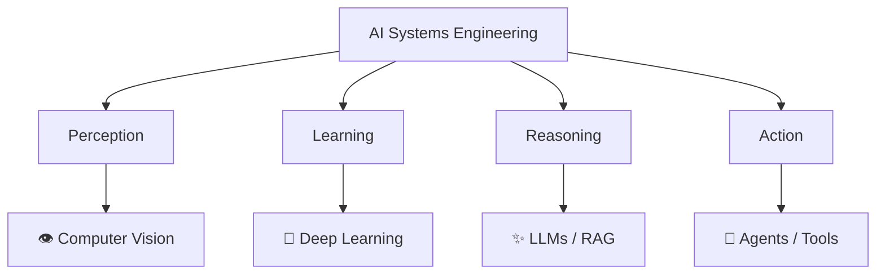

--- 
hide:
  - footer
  - toc
--- 

# About

Applied AI Engineer focused on building **end-to-end intelligent systems** — from perception → reasoning → action.

## 🧠 Core Capability Stack

## ⚙️ Engineering Principles

* **End-to-End Thinking**
  Design systems, not isolated models.

* **Production First**
  Focus on scalability, observability, and maintainability.

* **Data-Centric AI**
  Data quality > model complexity.

* **Composable Systems**
  Modular, extensible, and API-driven architectures.

* **Human-in-the-Loop**
  Keep systems controllable and interpretable.

## 🚀 What I Build

* AI Agents (voice, chat, multi-agent systems)
* Medical imaging AI (segmentation, analysis)
* Computer vision systems (detection, tracking)
* AI-powered SaaS platforms
* Backend systems for LLM applications

## 🔗 Explore

- [:lucide-compass: Direction](Direction.md) — where I’m heading and what I aim to build  
- [:lucide-leaf: Life](Life.md) — personal moments and life outside engineering  
- [:lucide-contact: Contact](Contact.md) — ways to reach me  

