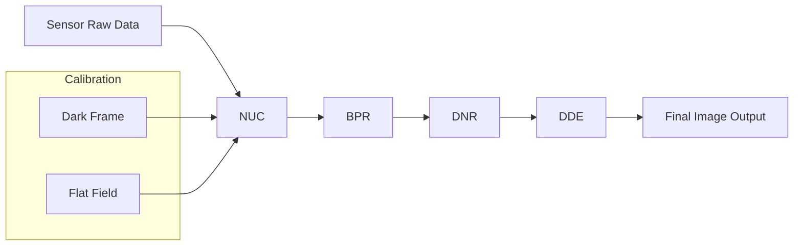

---
hide:
  - footer

icon: lucide/video
--- 

# :lucide-video: Camera System

**Period:** 2011 – 2015  
**Scope:** Camera Electro-Optical Systems  
**Tools:** MATLAB  

## Overview

Worked on low-level camera imaging pipeline and electro-optical system components, focusing on **image quality optimization**, **sensor calibration**, and **real-time processing algorithms**.

This role built the foundation for later work in computer vision and deep learning by developing a strong understanding of:

* sensor physics
* image signal processing (ISP)
* noise modeling and correction
* performance optimization under hardware constraints

## Imaging Pipeline Overview

## Key Contributions

* Built **sensor calibration pipelines** to improve image consistency and reliability
* Collaborated with hardware teams on **sensor-level improvements**
* Developed tools for **quantitative evaluation of image quality**
* Optimized algorithms for **real-time or near real-time performance**
* Designed and implemented core **image enhancement algorithms** for camera systems

## Works

* [Camera & Sensor Test Bench](camera-sensor-test-bench.md)
* [Non-Uniformity Correction (NUC)](nonuniformity-correction.md)
* [Bad Pixel Replacement (BPR)](bad-pixel-replacement.md)
* [Digital Noise Reduction (DNR)](digital-noise-reduction.md)
* [Digital Detail Enhancement (DDE)](digital-detail-enhancement.md)

## Tech Focus

`Sensor Calibration` · `Camera ISP` · `Signal Processing` · `Image Processing` · `MATLAB`

## Impact

* Improved overall **image quality consistency across sensors**
* Reduced **noise and artifacts in low-light conditions**
* Established reusable **algorithmic components for camera pipelines**
* Strengthened cross-domain expertise bridging **hardware and software**
