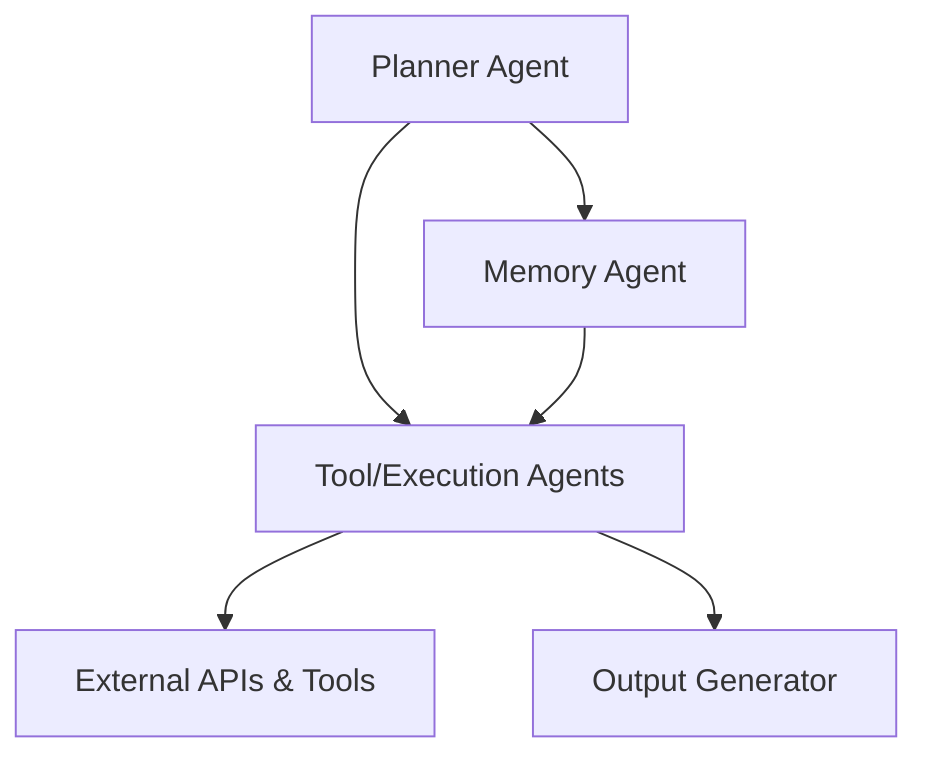
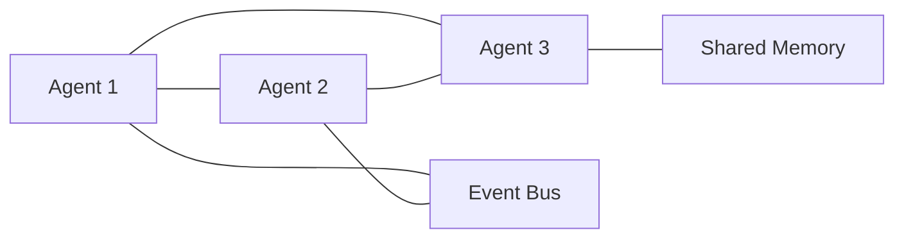
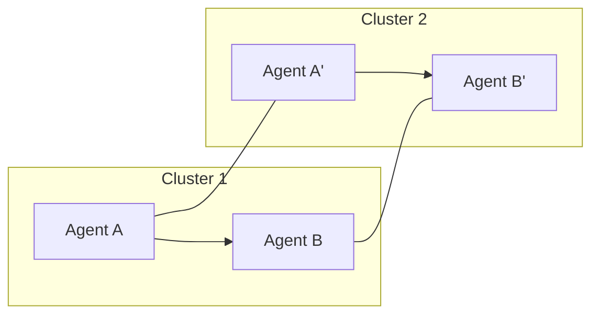

--- 
icon: lucide/panel-left-dashed
--- 

# :lucide-panel-left-dashed: Multi-Agent Architecture

## 🧠 Overview

A deep dive into designing **multi-agent AI systems** with multiple specialized agents collaborating to achieve complex tasks.

- Planner, executor, memory, and tool agents  
- Coordination, communication, and orchestration patterns  
- Scaling strategies for distributed AI agents  

## ⚖️ Design Principles

- **Modularity** → each agent has a clear responsibility  
- **Communication** → well-defined message protocols  
- **Decoupling** → minimize dependencies between agents  
- **Resilience** → graceful handling of agent failures  
- **Observability** → logging and metrics per agent  

## 🏗️ Architecture Components

1. **Planner Agent** → decides high-level task sequence
2. **Tool / Execution Agents** → handles API calls, LLM queries, external tools
3. **Memory Agent** → maintains short-term and long-term memory
4. **Coordinator / Orchestrator** → handles agent scheduling and state management

## 🔗 Agent Communication Patterns

* **Direct Messaging** → simple, low-latency
* **Event Bus / PubSub** → scalable, asynchronous
* **Shared Memory** → fast, but potential bottlenecks

## 🚀 Scaling Multi-Agent Systems

* Add agents horizontally
* Partition tasks by type or domain
* Monitor throughput, latency, and resource usage

## 🧪 Best Practices

* Start with a **small number of agents**
* Introduce complexity incrementally
* Use **robust logging** per agent
* Automate **failure recovery and retries**

## 💬 My Take

> Multi-agent systems are powerful, but start simple. Focus on **clear responsibilities, communication, and observability** before adding more agents.

